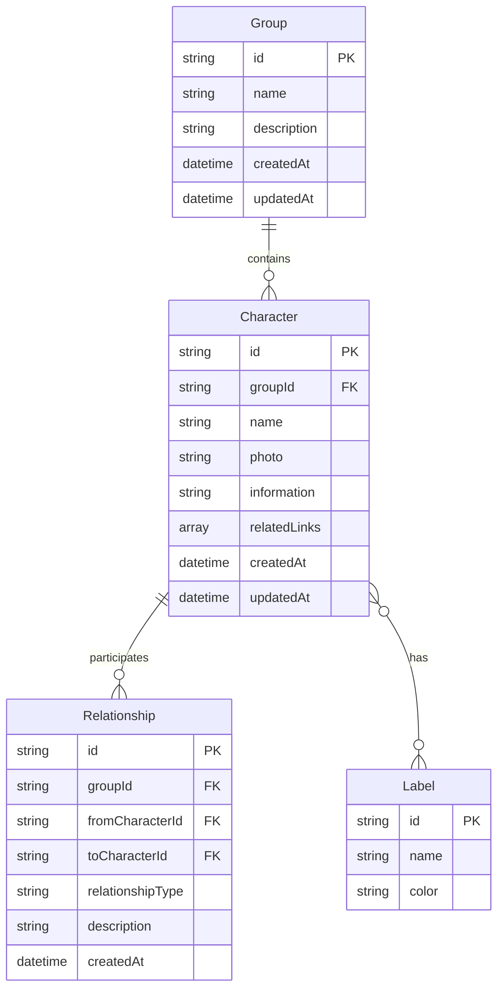

# 設計文書

## 概要

人物管理アプリケーションは、React + TypeScriptのフロントエンドとGo言語のバックエンドAPIに分離されたアーキテクチャとして設計されます。データの永続化にはMySQLを使用し、関係図の可視化にはD3.jsを採用します。フロントエンドとバックエンドが独立したモジュラーなアーキテクチャにより、各機能を独立して開発・テストできる構造とします。

## アーキテクチャ

### システム全体構成

```
┌─────────────────┐    ┌─────────────────┐    ┌─────────────────┐
│   Frontend      │    │    Backend      │    │    Database     │
│   (React)       │◄──►│     (Go)        │◄──►│    (MySQL)      │
│                 │    │                 │    │                 │
│ - React Components │  │ - REST API      │    │ - Groups        │
│ - Custom Hooks  │    │ - Business Logic│    │ - Characters    │
│ - D3.js Charts  │    │ - Validation    │    │ - Relationships │
│ - State Mgmt    │    │ - File Upload   │    │ - Labels        │
└─────────────────┘    └─────────────────┘    └─────────────────┘
```

### 技術スタック

**フロントエンド:**
- **フレームワーク**: React 18 + TypeScript + Vite
- **状態管理**: Zustand（軽量で使いやすい）
- **データ可視化**: D3.js v7（関係図描画）
- **HTTP通信**: Axios
- **スタイリング**: Tailwind CSS + Headless UI
- **画像処理**: Canvas API
- **ルーティング**: React Router v6

**バックエンド:**
- **言語**: Go 1.21+
- **Webフレームワーク**: Gin
- **ORM**: GORM
- **認証**: JWT（将来的な拡張用）
- **ファイルアップロード**: Multipart form handling
- **バリデーション**: go-playground/validator

**データベース:**
- **RDBMS**: MySQL 8.0+
- **マイグレーション**: GORM Auto Migration
- **接続プール**: database/sql標準ライブラリ

## コンポーネントとインターフェース

### フロントエンド構造

```
frontend/
├── src/
│   ├── components/
│   │   ├── common/           # 共通コンポーネント
│   │   │   ├── Button.tsx
│   │   │   ├── Modal.tsx
│   │   │   └── ImageUpload.tsx
│   │   ├── groups/           # グループ関連
│   │   │   ├── GroupList.tsx
│   │   │   ├── GroupCard.tsx
│   │   │   └── GroupForm.tsx
│   │   ├── characters/       # 人物関連
│   │   │   ├── CharacterList.tsx
│   │   │   ├── CharacterCard.tsx
│   │   │   ├── CharacterForm.tsx
│   │   │   └── CharacterDetail.tsx
│   │   ├── labels/           # ラベル関連
│   │   │   ├── LabelManager.tsx
│   │   │   └── LabelBadge.tsx
│   │   ├── relationships/    # 関係管理
│   │   │   ├── RelationshipForm.tsx
│   │   │   └── RelationshipList.tsx
│   │   └── visualization/    # 可視化
│   │       ├── RelationshipGraph.tsx
│   │       └── GraphControls.tsx
│   ├── hooks/                # カスタムフック
│   ├── services/             # API通信
│   ├── stores/               # 状態管理
│   ├── types/                # TypeScript型定義
│   └── utils/                # ユーティリティ
└── package.json

backend/
├── cmd/
│   └── server/
│       └── main.go           # エントリーポイント
├── internal/
│   ├── handlers/             # HTTPハンドラー
│   │   ├── groups.go
│   │   ├── characters.go
│   │   ├── relationships.go
│   │   └── labels.go
│   ├── models/               # データモデル
│   │   ├── group.go
│   │   ├── character.go
│   │   ├── relationship.go
│   │   └── label.go
│   ├── services/             # ビジネスロジック
│   │   ├── group_service.go
│   │   ├── character_service.go
│   │   └── relationship_service.go
│   ├── repositories/         # データアクセス層
│   │   ├── group_repository.go
│   │   ├── character_repository.go
│   │   └── relationship_repository.go
│   ├── middleware/           # ミドルウェア
│   │   ├── cors.go
│   │   └── error_handler.go
│   └── config/               # 設定
│       └── database.go
├── migrations/               # DBマイグレーション
├── go.mod
└── go.sum
```

### 主要インターフェース

```typescript
// 基本データ型
interface Group {
  id: string;
  name: string;
  description?: string;
  createdAt: Date;
  updatedAt: Date;
}

interface Character {
  id: string;
  groupId: string;
  name: string;
  photo?: string;
  information: string;
  relatedLinks: string[];
  labels: Label[];
  createdAt: Date;
  updatedAt: Date;
}

interface Label {
  id: string;
  name: string;
  color: string;
}

interface Relationship {
  id: string;
  groupId: string;
  character1Id: string;
  character2Id: string;
  relationshipType: string;
  description?: string;
  createdAt: Date;
}

// サービスインターフェース
interface GroupService {
  createGroup(data: CreateGroupData): Promise<Group>;
  updateGroup(id: string, data: UpdateGroupData): Promise<Group>;
  deleteGroup(id: string): Promise<void>;
  getGroups(): Promise<Group[]>;
  getGroupById(id: string): Promise<Group | null>;
}

interface CharacterService {
  createCharacter(data: CreateCharacterData): Promise<Character>;
  updateCharacter(id: string, data: UpdateCharacterData): Promise<Character>;
  deleteCharacter(id: string): Promise<void>;
  getCharactersByGroup(groupId: string): Promise<Character[]>;
  getCharacterById(id: string): Promise<Character | null>;
}
```

## データモデル

### MySQLスキーマ設計

```sql
-- Groups テーブル
CREATE TABLE groups (
    id VARCHAR(36) PRIMARY KEY,
    name VARCHAR(255) NOT NULL,
    description TEXT,
    created_at TIMESTAMP DEFAULT CURRENT_TIMESTAMP,
    updated_at TIMESTAMP DEFAULT CURRENT_TIMESTAMP ON UPDATE CURRENT_TIMESTAMP,
    INDEX idx_name (name),
    INDEX idx_created_at (created_at)
);

-- Labels テーブル
CREATE TABLE labels (
    id VARCHAR(36) PRIMARY KEY,
    name VARCHAR(100) NOT NULL UNIQUE,
    color VARCHAR(7) NOT NULL, -- HEX color code
    created_at TIMESTAMP DEFAULT CURRENT_TIMESTAMP
);

-- Characters テーブル
CREATE TABLE characters (
    id VARCHAR(36) PRIMARY KEY,
    group_id VARCHAR(36) NOT NULL,
    name VARCHAR(255) NOT NULL,
    photo VARCHAR(500), -- ファイルパスまたはURL
    information TEXT,
    related_links JSON, -- JSON配列として保存
    created_at TIMESTAMP DEFAULT CURRENT_TIMESTAMP,
    updated_at TIMESTAMP DEFAULT CURRENT_TIMESTAMP ON UPDATE CURRENT_TIMESTAMP,
    FOREIGN KEY (group_id) REFERENCES groups(id) ON DELETE CASCADE,
    INDEX idx_group_id (group_id),
    INDEX idx_name (name)
);

-- Character-Label 中間テーブル（多対多関係）
CREATE TABLE character_labels (
    character_id VARCHAR(36),
    label_id VARCHAR(36),
    PRIMARY KEY (character_id, label_id),
    FOREIGN KEY (character_id) REFERENCES characters(id) ON DELETE CASCADE,
    FOREIGN KEY (label_id) REFERENCES labels(id) ON DELETE CASCADE
);

-- Relationships テーブル（双方向関係の統一管理）
CREATE TABLE relationships (
    id VARCHAR(36) PRIMARY KEY,
    group_id VARCHAR(36) NOT NULL,
    character1_id VARCHAR(36) NOT NULL,
    character2_id VARCHAR(36) NOT NULL,
    relationship_type VARCHAR(100) NOT NULL,
    description TEXT,
    created_at TIMESTAMP DEFAULT CURRENT_TIMESTAMP,
    FOREIGN KEY (group_id) REFERENCES groups(id) ON DELETE CASCADE,
    FOREIGN KEY (character1_id) REFERENCES characters(id) ON DELETE CASCADE,
    FOREIGN KEY (character2_id) REFERENCES characters(id) ON DELETE CASCADE,
    -- 双方向関係の重複を防ぐため、小さいIDを常にcharacter1_idに配置
    CONSTRAINT check_character_order CHECK (character1_id < character2_id),
    UNIQUE KEY unique_relationship (character1_id, character2_id),
    INDEX idx_group_id (group_id),
    INDEX idx_character1 (character1_id),
    INDEX idx_character2 (character2_id)
);
```

### Go構造体定義

```go
// Group モデル
type Group struct {
    ID          string    `json:"id" gorm:"primaryKey;type:varchar(36)"`
    Name        string    `json:"name" gorm:"not null;size:255" validate:"required,max=255"`
    Description *string   `json:"description" gorm:"type:text"`
    CreatedAt   time.Time `json:"createdAt" gorm:"autoCreateTime"`
    UpdatedAt   time.Time `json:"updatedAt" gorm:"autoUpdateTime"`
    Characters  []Character `json:"characters,omitempty" gorm:"foreignKey:GroupID;constraint:OnDelete:CASCADE"`
}

// Label モデル
type Label struct {
    ID        string    `json:"id" gorm:"primaryKey;type:varchar(36)"`
    Name      string    `json:"name" gorm:"uniqueIndex;not null;size:100" validate:"required,max=100"`
    Color     string    `json:"color" gorm:"not null;size:7" validate:"required,hexcolor"`
    CreatedAt time.Time `json:"createdAt" gorm:"autoCreateTime"`
}

// Character モデル
type Character struct {
    ID           string    `json:"id" gorm:"primaryKey;type:varchar(36)"`
    GroupID      string    `json:"groupId" gorm:"not null;type:varchar(36)" validate:"required"`
    Name         string    `json:"name" gorm:"not null;size:255" validate:"required,max=255"`
    Photo        *string   `json:"photo" gorm:"size:500"`
    Information  string    `json:"information" gorm:"type:text"`
    RelatedLinks datatypes.JSON `json:"relatedLinks" gorm:"type:json"`
    CreatedAt    time.Time `json:"createdAt" gorm:"autoCreateTime"`
    UpdatedAt    time.Time `json:"updatedAt" gorm:"autoUpdateTime"`
    Group        Group     `json:"group,omitempty" gorm:"foreignKey:GroupID"`
    Labels       []Label   `json:"labels,omitempty" gorm:"many2many:character_labels"`
}

// Relationship モデル（双方向関係の統一管理）
type Relationship struct {
    ID               string    `json:"id" gorm:"primaryKey;type:varchar(36)"`
    GroupID          string    `json:"groupId" gorm:"not null;type:varchar(36)" validate:"required"`
    Character1ID     string    `json:"character1Id" gorm:"not null;type:varchar(36)" validate:"required"`
    Character2ID     string    `json:"character2Id" gorm:"not null;type:varchar(36)" validate:"required"`
    RelationshipType string    `json:"relationshipType" gorm:"not null;size:100" validate:"required,max=100"`
    Description      *string   `json:"description" gorm:"type:text"`
    CreatedAt        time.Time `json:"createdAt" gorm:"autoCreateTime"`
    Group            Group     `json:"group,omitempty" gorm:"foreignKey:GroupID"`
    Character1       Character `json:"character1,omitempty" gorm:"foreignKey:Character1ID"`
    Character2       Character `json:"character2,omitempty" gorm:"foreignKey:Character2ID"`
}
```

### データ関係



## エラーハンドリング

### エラー分類と対応

1. **データベースエラー（バックエンド）**
   - MySQL接続失敗: 接続プールの再試行とヘルスチェック
   - トランザクション失敗: ロールバックと適切なエラーレスポンス
   - 制約違反: バリデーションエラーとして適切なメッセージを返却

2. **バリデーションエラー**
   - **フロントエンド**: Zodライブラリによる型安全なバリデーション
   - **バックエンド**: go-playground/validatorによるサーバーサイドバリデーション
   - 必須フィールド未入力: フォームレベルでの即座フィードバック

3. **API通信エラー**
   - ネットワークエラー: 自動リトライとオフライン状態の表示
   - 認証エラー: ログイン画面へのリダイレクト
   - サーバーエラー: ユーザーフレンドリーなエラーメッセージ

4. **ファイルアップロードエラー**
   - ファイルサイズ超過: 自動リサイズまたはエラーメッセージ
   - 対応外形式: サポート形式の明示
   - アップロード失敗: リトライ機能

5. **関係図描画エラー**
   - データ量過多: ページネーションまたは表示制限
   - レンダリング失敗: シンプルなリスト表示へのフォールバック

### エラー処理パターン

**フロントエンド:**
```typescript
// エラーバウンダリーコンポーネント
class ErrorBoundary extends React.Component {
  // エラーキャッチとフォールバックUI表示
}

// API通信でのエラーハンドリング
class ApiService {
  async request<T>(config: AxiosRequestConfig): Promise<Result<T, ApiError>> {
    try {
      const response = await axios(config);
      return { success: true, data: response.data };
    } catch (error) {
      return { success: false, error: this.handleError(error) };
    }
  }
}
```

**バックエンド:**
```go
// カスタムエラー型
type AppError struct {
    Code    string `json:"code"`
    Message string `json:"message"`
    Details interface{} `json:"details,omitempty"`
}

// エラーハンドリングミドルウェア
func ErrorHandler() gin.HandlerFunc {
    return func(c *gin.Context) {
        c.Next()
        
        if len(c.Errors) > 0 {
            err := c.Errors.Last()
            switch e := err.Err.(type) {
            case *AppError:
                c.JSON(400, e)
            case validator.ValidationErrors:
                c.JSON(400, formatValidationError(e))
            default:
                c.JSON(500, AppError{
                    Code: "INTERNAL_ERROR",
                    Message: "Internal server error",
                })
            }
        }
    }
}
```

## テスト戦略

### テストピラミッド

1. **ユニットテスト（70%）**
   - サービスクラスのビジネスロジック
   - ユーティリティ関数
   - カスタムフック
   - ツール: Jest + Testing Library

2. **統合テスト（20%）**
   - コンポーネント間の連携
   - データベース操作
   - ツール: Jest + Testing Library + MSW

3. **E2Eテスト（10%）**
   - 主要ユーザーフロー
   - ツール: Playwright

### テスト対象の優先順位

1. **高優先度**
   - データの作成・更新・削除操作
   - 関係図の基本描画機能
   - データの永続化

2. **中優先度**
   - フォームバリデーション
   - 画像アップロード・処理
   - ラベル管理

3. **低優先度**
   - UI/UXの細かい動作
   - 関係図の高度な操作

### テストデータ管理

```typescript
// テスト用のファクトリー関数
const createTestGroup = (overrides?: Partial<Group>): Group => ({
  id: 'test-group-1',
  name: 'Test Group',
  description: 'Test Description',
  createdAt: new Date(),
  updatedAt: new Date(),
  ...overrides
});

const createTestCharacter = (overrides?: Partial<Character>): Character => ({
  id: 'test-char-1',
  groupId: 'test-group-1',
  name: 'Test Character',
  information: 'Test Information',
  relatedLinks: [],
  labels: [],
  createdAt: new Date(),
  updatedAt: new Date(),
  ...overrides
});
```

この設計により、スケーラブルで保守性の高い人物管理アプリケーションを構築できます。各レイヤーが明確に分離されており、テスト可能で拡張しやすい構造となっています。